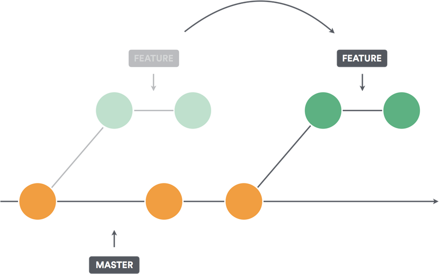

# Updating Feature Branch

- git rebase
- git pull origin master


## git rebase



`git rebase` rewrites the commit history. It can be harmful to do it in shared branches. 

It can cause complex and hard to resolve merge conflicts. In these cases, instead of rebasing your branch against the default branch, consider pulling it instead. 

It has a similar effect without compromising the work of your contributors.

## git pull origin master

Switch to feature branch you want to update and execute:

```
git pull origin master
```